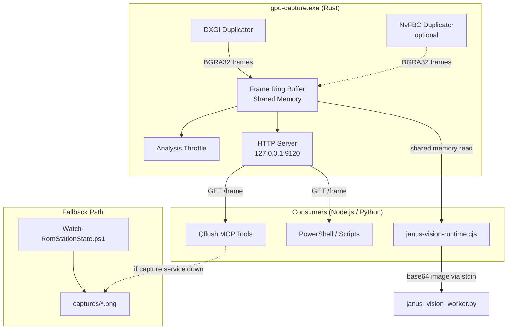
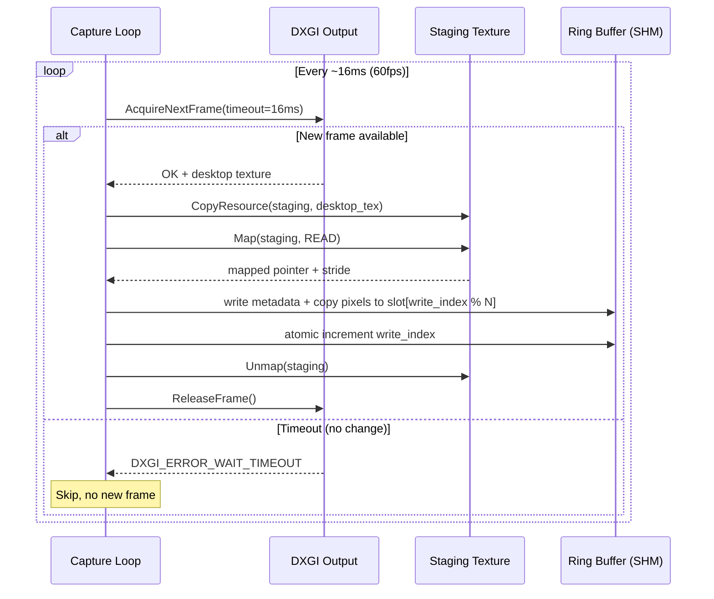
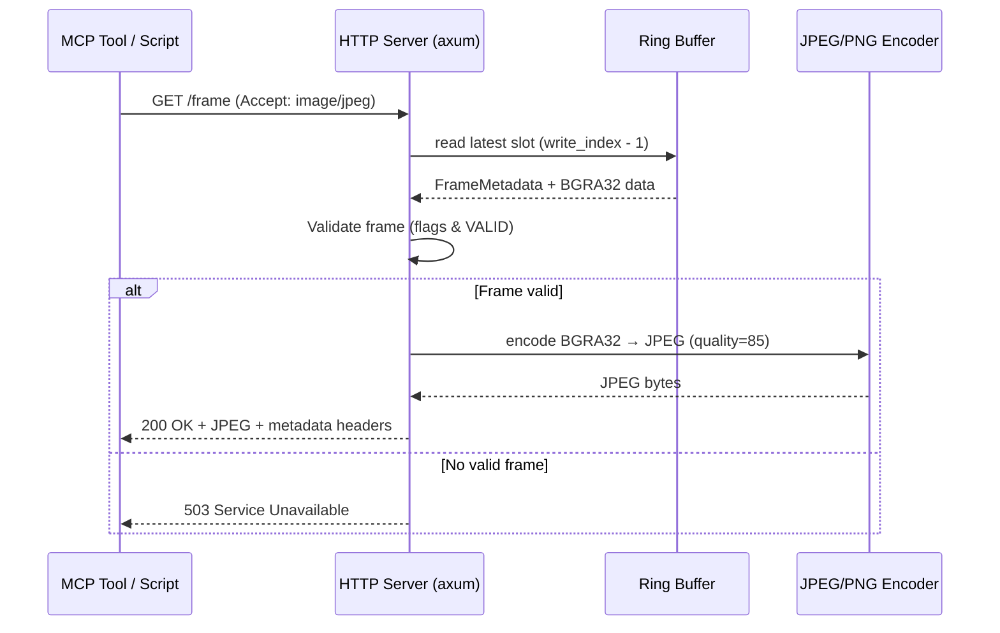
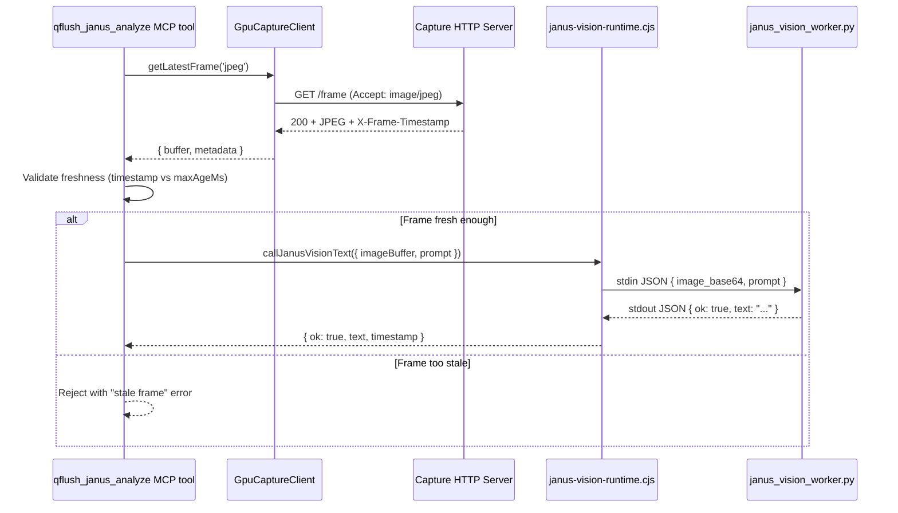
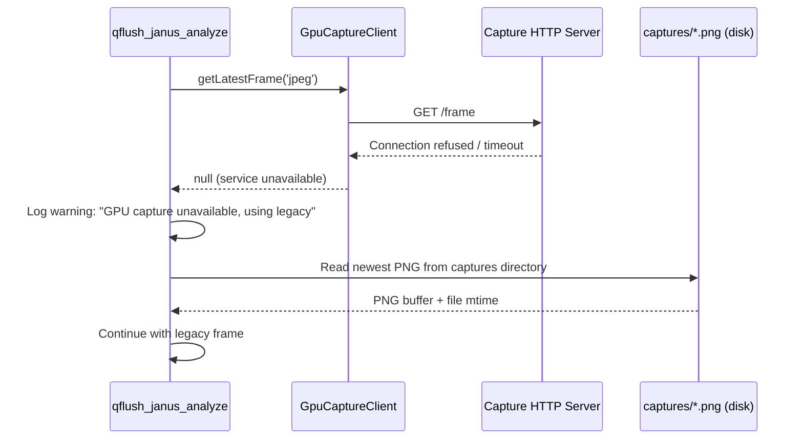
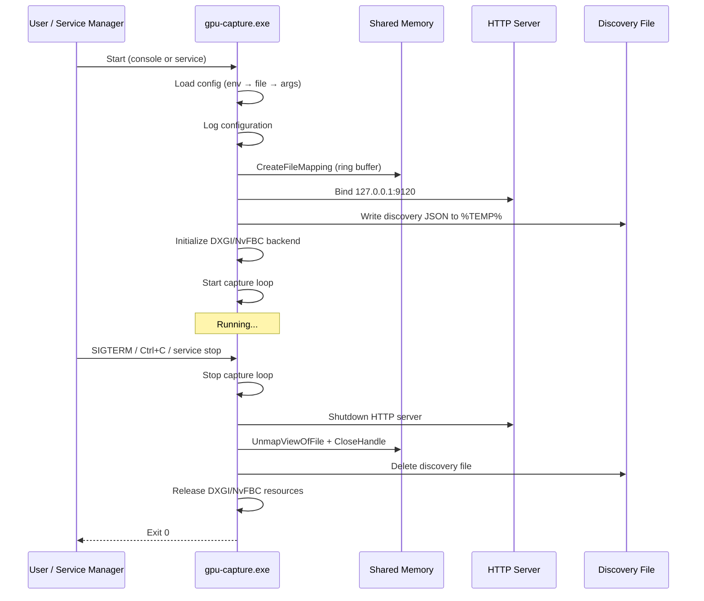

# Design Document: GPU Framebuffer Capture

## Overview

This design replaces the current file-based PowerShell screenshot pipeline with a high-performance GPU framebuffer capture service. The service captures frames directly from the GPU via the DXGI Desktop Duplication API, stores them in a shared memory ring buffer, and exposes them through a local HTTP endpoint. This eliminates the ~500ms+ file I/O bottleneck, enabling sub-16ms frame acquisition for the Janus-Pro-7B vision analysis pipeline.

### Design Goals

- **Low latency**: Frame acquisition under 16ms (DXGI) or 8ms (NvFBC)
- **Zero file I/O**: Frames flow through shared memory, never touching disk
- **Standalone service**: Independent executable, startable/stoppable without affecting the Node.js backend
- **Graceful fallback**: If the capture service is unavailable, the system falls back to the existing PowerShell screenshot method
- **Local-only**: All endpoints bound to 127.0.0.1, no remote access

### Technology Choice: Rust

The capture service is implemented in **Rust** for the following reasons:

1. **Memory safety without GC**: Critical for a long-running service managing GPU resources and shared memory
2. **Excellent Windows API bindings**: The `windows` crate provides safe, idiomatic access to DXGI/D3D11 COM interfaces
3. **Mature capture ecosystem**: `rusty-duplication` and `win_desktop_duplication` crates provide tested DXGI Desktop Duplication wrappers
4. **Single binary deployment**: No runtime dependencies, easy to distribute as a standalone `.exe`
5. **Performance**: Zero-cost abstractions for the hot capture loop, atomic operations for lock-free ring buffer
6. **HTTP server**: `axum` or `warp` provide lightweight, async HTTP with minimal overhead

Alternative considered: C++ with raw COM — rejected due to manual memory management risk in a long-running service. Python with ctypes — rejected due to GIL limitations and latency overhead.

## Architecture



### Component Responsibilities

| Component | Responsibility |
|-----------|---------------|
| **gpu-capture.exe** | Standalone Rust binary: captures frames, manages ring buffer, serves HTTP |
| **janus-vision-runtime.cjs** | Reads frames from shared memory or HTTP, sends to Janus worker |
| **Qflush MCP tools** | Retrieve latest frame via HTTP for agent-triggered analysis |
| **Watch-RomStationState.ps1** | Legacy fallback: saves PNGs to disk when capture service is unavailable |

## Components and Interfaces

### 1. Capture Backend (Rust module: `capture`)

Responsible for acquiring frames from the GPU.

```rust
/// Trait for capture backends
pub trait CaptureBackend: Send {
    /// Initialize the capture backend for the given target
    fn init(&mut self, target: &CaptureTarget) -> Result<(), CaptureError>;

    /// Acquire the next frame. Returns None if no new frame is available.
    fn acquire_frame(&mut self) -> Result<Option<RawFrame>, CaptureError>;

    /// Release resources and reinitialize (e.g., after desktop switch)
    fn reinit(&mut self) -> Result<(), CaptureError>;

    /// Get backend name for logging
    fn name(&self) -> &str;
}

pub struct DxgiBackend { /* D3D11 device, output duplication, staging texture */ }
pub struct NvfbcBackend { /* NvFBC session handle */ }
```

**DXGI flow**:
1. Create D3D11 device + DXGI factory
2. Enumerate outputs, select target monitor
3. Call `IDXGIOutput1::DuplicateOutput` to get `IDXGIOutputDuplication`
4. In capture loop: `AcquireNextFrame` → copy GPU texture to CPU staging buffer → `Map` staging texture → write to ring buffer → `Unmap` → `ReleaseFrame`

**NvFBC flow** (optional, loaded dynamically):
1. Load `NvFBC64.dll` at runtime via `LoadLibrary`
2. Create NvFBC session with `NVFBC_TO_SYS` capture type
3. In capture loop: `NvFBCToSysGrabFrame` → write directly to ring buffer

### 2. Capture Target Manager (Rust module: `target`)

```rust
pub enum CaptureTarget {
    PrimaryMonitor,
    Monitor { index: u32 },
    Window { hwnd: u64, title_regex: Option<String> },
    FullDesktop,
}

pub struct TargetManager {
    current: CaptureTarget,
    window_tracker: Option<WindowTracker>,
}

impl TargetManager {
    /// Resolve the capture region (x, y, width, height) for the current target
    pub fn resolve_region(&self) -> Result<CaptureRegion, TargetError>;

    /// Check if the target is still valid (window not closed, monitor still connected)
    pub fn validate(&self) -> TargetStatus;

    /// Update target at runtime
    pub fn set_target(&mut self, target: CaptureTarget);
}
```

### 3. Frame Ring Buffer (Rust module: `ring_buffer`)

Lock-free single-producer/single-consumer ring buffer in Windows named shared memory.

```rust
pub struct FrameRingBuffer {
    shm_handle: HANDLE,
    base_ptr: *mut u8,
    header: *mut RingBufferHeader,
    slots: Vec<FrameSlotPtr>,
    config: RingBufferConfig,
}

#[repr(C)]
pub struct RingBufferHeader {
    magic: u32,                    // 0x46524D42 ("FRMB")
    version: u32,                  // Protocol version (1)
    slot_count: u32,               // Number of frame slots (default 4)
    slot_size: u64,                // Size of each slot in bytes
    max_width: u32,                // Maximum frame width
    max_height: u32,               // Maximum frame height
    write_index: AtomicU64,        // Current write position (monotonically increasing)
    total_region_size: u64,        // Total shared memory size
}

#[repr(C)]
pub struct FrameMetadata {
    sequence: u64,                 // Monotonically increasing frame number
    timestamp_us: u64,             // Capture timestamp (microseconds since epoch)
    width: u32,                    // Actual frame width
    height: u32,                   // Actual frame height
    stride: u32,                   // Row stride in bytes
    pixel_format: u32,             // 0 = BGRA32
    target_id: [u8; 64],           // Capture target identifier (null-terminated UTF-8)
    flags: u32,                    // Bit flags: 0x1 = valid, 0x2 = keyframe
    reserved: [u8; 28],           // Future use, zeroed
}

#[repr(C)]
pub struct FrameSlot {
    metadata: FrameMetadata,       // 128 bytes
    data: [u8],                    // BGRA32 pixel data (stride * height bytes)
}
```

**Shared memory naming**: `Local\A11_GPU_CAPTURE_{random_suffix}` where `random_suffix` is a 16-character hex string generated at startup and written to a discovery file.

**Lock-free protocol**:
- Producer writes frame data first, then atomically increments `write_index`
- Consumer reads `write_index`, computes slot = `write_index % slot_count`, reads metadata, validates `sequence == write_index` to detect torn reads
- If sequence mismatch: retry with the next older slot

### 4. HTTP Frame Server (Rust module: `http_server`)

Lightweight HTTP server using `axum`, bound to `127.0.0.1:9120`.

```
GET /frame
  Accept: image/jpeg → JPEG response (quality from config, default 85)
  Accept: image/png  → PNG response
  Accept: */*        → JPEG response (default)

  Response Headers:
    X-Frame-Sequence: <u64>
    X-Frame-Timestamp: <ISO 8601 with microseconds>
    X-Frame-Width: <u32>
    X-Frame-Height: <u32>
    X-Frame-Target: <string>
    X-Capture-Latency-Us: <u64>

  Status Codes:
    200 OK           → Frame returned
    503 Unavailable  → No frame captured yet or capture paused

GET /status
  Response: JSON
  {
    "ok": true,
    "backend": "dxgi" | "nvfbc",
    "target": { "type": "window", "title": "RomStation" },
    "fps": 60.0,
    "frame_count": 12345,
    "last_frame_timestamp": "2025-01-15T10:30:00.123456Z",
    "shared_memory": {
      "name": "Local\\A11_GPU_CAPTURE_a1b2c3d4e5f6g7h8",
      "slot_count": 4,
      "slot_size": 8294400
    },
    "uptime_seconds": 3600
  }

POST /config
  Body: JSON with partial config updates
  {
    "target": { "type": "window", "title_regex": "RomStation|Bloody Roar" },
    "throttle_fps": 2.0,
    "downscale": { "width": 1280, "height": 720 }
  }
  Response: { "ok": true, "applied": {...} }

POST /frame/request
  Burst mode: request a single frame analysis regardless of throttle
  Response: { "ok": true, "sequence": 12346 }
```

### 5. Analysis Throttle (Rust module: `throttle`)

```rust
pub struct AnalysisThrottle {
    target_fps: AtomicF64,         // Configurable, default 2.0
    last_forwarded: AtomicU64,     // Timestamp of last forwarded frame
    inference_busy: AtomicBool,    // True while Janus is processing
    burst_requested: AtomicBool,   // One-shot burst flag
}

impl AnalysisThrottle {
    /// Check if the current frame should be forwarded for analysis
    pub fn should_forward(&self, frame_timestamp_us: u64) -> bool;

    /// Mark inference as started
    pub fn mark_busy(&self);

    /// Mark inference as complete
    pub fn mark_idle(&self);

    /// Request a single burst frame
    pub fn request_burst(&self);

    /// Update target FPS at runtime
    pub fn set_fps(&self, fps: f64);
}
```

### 6. Node.js Shared Memory Reader (module: `lib/gpu-capture-client.cjs`)

Node.js module that reads frames from the shared memory ring buffer using `node-ffi-napi` or a small native addon.

```javascript
// lib/gpu-capture-client.cjs
class GpuCaptureClient {
  constructor(options = {}) {
    this.source = options.source || process.env.A11_CAPTURE_SOURCE || 'auto';
    this.httpUrl = options.httpUrl || `http://127.0.0.1:${process.env.A11_CAPTURE_HTTP_PORT || 9120}`;
    this.shmName = options.shmName || null; // Auto-discovered from status endpoint
  }

  /** Get the latest frame as a Buffer (PNG or JPEG encoded) */
  async getLatestFrame(format = 'jpeg') { }

  /** Get frame metadata without pixel data */
  async getFrameMetadata() { }

  /** Check if the capture service is running */
  async isAvailable() { }

  /** Request a burst frame (bypasses throttle) */
  async requestBurst() { }
}
```

**Source resolution order** (when `A11_CAPTURE_SOURCE=auto`):
1. Try HTTP endpoint at configured port
2. If HTTP fails, try shared memory (if native addon available)
3. If both fail, return `null` (caller falls back to legacy)

### 7. Integration Layer Updates

**janus-vision-runtime.cjs changes**:
- Add `GpuCaptureClient` import
- Before spawning analysis, check if capture service is available
- If available: fetch frame via HTTP, encode as base64, pass to worker
- If unavailable: use existing file-based path
- Include `X-Frame-Timestamp` in analysis results for freshness validation

**Qflush MCP tool changes** (in the A11 MCP server):
- `qflush_janus_analyze`: fetch frame from `http://127.0.0.1:9120/frame` instead of reading from captures directory
- `qflush_media_analyze`: same frame source, combined with audio
- Both validate freshness using `X-Frame-Timestamp` header against `maxAgeMs` parameter
- Fallback: if HTTP fetch fails, read from captures directory as before

## Data Models

### Configuration Schema

```json
{
  "$schema": "gpu-capture-config.v1",
  "capture": {
    "backend": "auto",
    "target": {
      "type": "window",
      "title_regex": "RomStation|Bloody Roar"
    },
    "fps": 60
  },
  "ring_buffer": {
    "slot_count": 4,
    "max_width": 1920,
    "max_height": 1080,
    "shm_name_prefix": "Local\\A11_GPU_CAPTURE_"
  },
  "http": {
    "enabled": true,
    "port": 9120,
    "bind": "127.0.0.1",
    "jpeg_quality": 85
  },
  "throttle": {
    "analysis_fps": 2.0,
    "burst_enabled": true
  },
  "downscale": {
    "enabled": false,
    "width": 1280,
    "height": 720,
    "method": "bilinear"
  },
  "logging": {
    "level": "info",
    "file": "gpu-capture.log"
  }
}
```

### Environment Variables

| Variable | Default | Description |
|----------|---------|-------------|
| `A11_CAPTURE_SOURCE` | `auto` | Frame source: `gpu-capture`, `http-endpoint`, `legacy-screenshot` |
| `A11_CAPTURE_HTTP_PORT` | `9120` | HTTP endpoint port |
| `A11_CAPTURE_HTTP_HOST` | `127.0.0.1` | HTTP bind address (always loopback) |
| `A11_CAPTURE_BACKEND` | `auto` | Capture backend: `auto`, `dxgi`, `nvfbc` |
| `A11_CAPTURE_TARGET` | `primary` | Target: `primary`, `monitor:0`, `window:RomStation` |
| `A11_CAPTURE_FPS` | `60` | Capture rate (frames per second) |
| `A11_CAPTURE_THROTTLE_FPS` | `2.0` | Analysis throttle rate |
| `A11_CAPTURE_RING_SLOTS` | `4` | Number of ring buffer slots |
| `A11_CAPTURE_MAX_WIDTH` | `1920` | Maximum capture width |
| `A11_CAPTURE_MAX_HEIGHT` | `1080` | Maximum capture height |
| `A11_CAPTURE_JPEG_QUALITY` | `85` | JPEG encoding quality (1-100) |
| `A11_CAPTURE_DOWNSCALE` | `` | Downscale resolution (e.g., `1280x720`) |
| `A11_CAPTURE_CONFIG` | `` | Path to JSON config file |
| `A11_CAPTURE_LOG_LEVEL` | `info` | Log level: `trace`, `debug`, `info`, `warn`, `error` |
| `A11_CAPTURE_SHM_NAME` | `` | Override shared memory name (auto-generated if empty) |

### Shared Memory Layout (Binary)

```
Offset 0x0000: RingBufferHeader (128 bytes)
  [0x00] magic:             u32 = 0x46524D42
  [0x04] version:           u32 = 1
  [0x08] slot_count:        u32 = 4
  [0x0C] padding:           u32 = 0
  [0x10] slot_size:         u64
  [0x18] max_width:         u32
  [0x1C] max_height:        u32
  [0x20] write_index:       u64 (atomic)
  [0x28] total_region_size: u64
  [0x30..0x80] reserved:    zeroed

Offset 0x0080: FrameSlot[0]
  [+0x00] metadata:  FrameMetadata (128 bytes)
  [+0x80] data:      u8[slot_size - 128]

Offset 0x0080 + slot_size: FrameSlot[1]
  ...

Total size = 128 + (slot_count * slot_size)
Default: 128 + (4 * (128 + 1920*1080*4)) = 128 + 4 * 8,294,528 = ~31.7 MB
```

### Discovery File

When the capture service starts, it writes a JSON discovery file so consumers can find the shared memory region:

**Path**: `%TEMP%\a11-gpu-capture.json` (or `A11_CAPTURE_DISCOVERY_FILE` env var)

```json
{
  "pid": 12345,
  "started_at": "2025-01-15T10:00:00Z",
  "shm_name": "Local\\A11_GPU_CAPTURE_a1b2c3d4e5f6g7h8",
  "http_port": 9120,
  "backend": "dxgi",
  "target": { "type": "window", "title_regex": "RomStation" },
  "version": "1.0.0"
}
```

## Sequence Diagrams

### Frame Capture Loop



### HTTP Frame Request



### Janus Analysis Flow (New Path)



### Fallback Flow



### Service Lifecycle



## Error Handling

### Capture Backend Errors

| Error | Recovery |
|-------|----------|
| `DXGI_ERROR_ACCESS_LOST` | Desktop switch or resolution change. Reinitialize output duplication after 1s delay. |
| `DXGI_ERROR_DEVICE_REMOVED` | GPU reset or driver crash. Recreate D3D11 device and output duplication. |
| `DXGI_ERROR_WAIT_TIMEOUT` | No desktop change since last frame. Normal, skip iteration. |
| `E_ACCESSDENIED` | Session locked or UAC prompt. Pause capture, poll session state every 1s. |
| NvFBC load failure | DLL not found or unsupported GPU. Fall back to DXGI silently. |
| Target window closed | Emit `target-lost` event, pause capture, poll for window reappearance. |

### Shared Memory Errors

| Error | Recovery |
|-------|----------|
| `CreateFileMapping` fails | Insufficient memory or name collision. Retry with different name, exit if persistent. |
| Consumer detects torn read | Sequence mismatch. Retry with next older slot. If all slots torn, skip this read. |
| Shared memory region too small | Configuration error. Log error and exit with descriptive message. |

### HTTP Server Errors

| Error | Recovery |
|-------|----------|
| Port already in use | Log error, try next port (9121, 9122...), or exit with error. |
| Non-loopback connection | Reject with 403, log security warning with source IP. |
| Encoding failure | Return 500 with error body. Should not happen with valid frame data. |

### Resource Safety

- All GPU textures released via RAII (`Drop` trait in Rust)
- Shared memory handles closed on service exit (even on panic, via `Drop`)
- Discovery file deleted on clean exit; stale files detected by PID check on startup
- GPU memory monitoring: if available VRAM < 256MB, reduce capture resolution to 720p or pause

## Testing Strategy

### Unit Tests

- **Ring buffer protocol**: Test write/read sequences, wraparound, torn read detection
- **Configuration parsing**: Test env var, JSON file, and CLI arg priority resolution
- **Target resolution**: Test window tracking, monitor enumeration, region calculation
- **Throttle logic**: Test rate limiting, burst mode, busy/idle transitions
- **Frame encoding**: Test BGRA32 → JPEG/PNG conversion correctness
- **Discovery file**: Test write/read/cleanup lifecycle

### Integration Tests

- **DXGI capture**: Verify frame acquisition on a real Windows desktop (CI with GPU)
- **HTTP endpoint**: Start service, fetch frame via HTTP, validate headers and image
- **Shared memory IPC**: Write frames from one process, read from another, verify data integrity
- **Fallback behavior**: Kill capture service, verify consumers fall back to legacy path
- **Session handling**: Lock/unlock desktop, verify capture pauses and resumes

### Property-Based Tests

Property-based testing applies to the core data transformation and protocol logic. See Correctness Properties below for the full list.

**Library**: `proptest` (Rust) for the capture service, `fast-check` (TypeScript/Node.js) for the client module.

**Configuration**: Minimum 100 iterations per property test.

## Correctness Properties

*A property is a characteristic or behavior that should hold true across all valid executions of a system — essentially, a formal statement about what the system should do. Properties serve as the bridge between human-readable specifications and machine-verifiable correctness guarantees.*

### Property 1: Ring buffer capacity invariant

*For any* ring buffer with N slots and any sequence of M frames written (where M > N), only the most recent N frames SHALL be readable, and the oldest frames SHALL have been overwritten.

**Validates: Requirements 4.1, 4.4**

### Property 2: Ring buffer write/read round-trip

*For any* valid frame (with arbitrary pixel data, dimensions, timestamp, sequence number, and target identifier), writing it to the ring buffer and then reading from the corresponding slot SHALL return identical frame data and complete metadata (timestamp, sequence, width, height, stride, pixel format, target ID).

**Validates: Requirements 4.2, 4.3**

### Property 3: Torn read detection

*For any* ring buffer state where the producer overwrites a slot while a consumer is reading it, the consumer SHALL detect the torn read via a sequence number mismatch (read sequence ≠ expected sequence) and SHALL NOT return corrupted data.

**Validates: Requirements 4.6**

### Property 4: Concurrent read/write consistency

*For any* interleaved sequence of single-producer writes and single-consumer reads on the ring buffer, the consumer SHALL never observe partially-written frame data — every successfully read frame SHALL be a complete, valid frame that was written by the producer.

**Validates: Requirements 4.5**

### Property 5: Window crop correctness

*For any* window position (x, y) and size (width, height) within a captured desktop frame, the crop operation SHALL produce an output frame with dimensions exactly equal to the window's client area, and *for any* sequence of window move/resize events, the capture region SHALL track the window position correctly after each event.

**Validates: Requirements 3.2, 3.5**

### Property 6: HTTP content negotiation

*For any* valid frame in the ring buffer and any Accept header value (image/jpeg, image/png, or */\*), the HTTP endpoint SHALL return a response with Content-Type matching the requested format, and the response body SHALL be a valid image decodable to the original frame dimensions.

**Validates: Requirements 5.2, 5.4, 5.5, 13.2**

### Property 7: Throttle rate limiting with busy-skip

*For any* sequence of frame timestamps spanning duration D seconds and any configured throttle rate R (0.5–10 fps), the number of frames forwarded for analysis SHALL NOT exceed ceil(R × D) + 1 (burst allowance), AND no frame SHALL be forwarded while the inference-busy flag is set.

**Validates: Requirements 6.1, 6.3**

### Property 8: Frame freshness validation

*For any* frame with timestamp T and any configured maxAgeMs value M, the freshness validator SHALL accept the frame if and only if (current_time - T) ≤ M milliseconds.

**Validates: Requirements 8.3**

### Property 9: Configuration priority resolution

*For any* configuration key with values set in environment variables (V_env), JSON config file (V_file), and command-line arguments (V_cli), the resolved value SHALL equal V_env when set, otherwise V_cli when set, otherwise V_file when set, otherwise the default value. (Priority: env > cli > file > default.)

**Validates: Requirements 9.4**

### Property 10: BGRA32 to RGB conversion correctness

*For any* BGRA32 pixel (b, g, r, a), converting to RGB SHALL produce (r, g, b) — the blue and red channels are swapped and the alpha channel is dropped. This SHALL hold for all pixel values in [0, 255].

**Validates: Requirements 13.3**

### Property 11: Downscaling with aspect ratio preservation

*For any* input frame with dimensions (W_in, H_in) and any target resolution (W_target, H_target), the downscaled output dimensions (W_out, H_out) SHALL satisfy: W_out ≤ W_target AND H_out ≤ H_target AND |W_out/H_out - W_in/H_in| < epsilon (aspect ratio preserved within floating-point tolerance).

**Validates: Requirements 13.4, 13.5**

### Property 12: Shared memory name uniqueness

*For any* two independent invocations of the Capture_Service, the generated shared memory names SHALL be distinct (collision probability < 2^-64 given the 16-character hex random suffix).

**Validates: Requirements 12.3**
