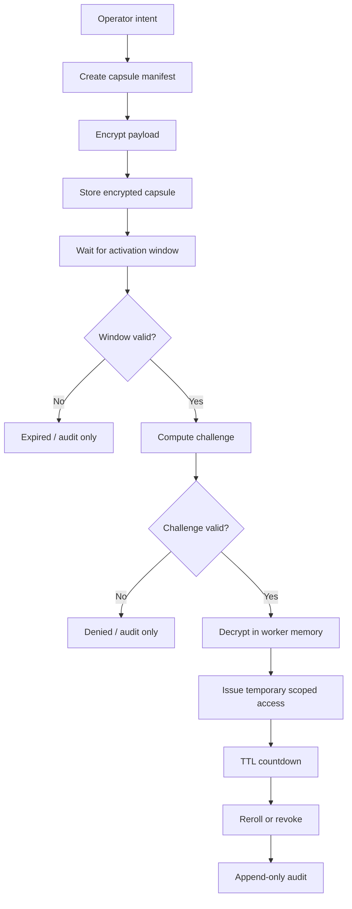

# RubixGate Time-Lock Capsule Plan - 2026-05-14

Status: proposal
Owner: Funesterie operators
Audience: A11, Kaen44, Kiro, Codex, ChatGPT, external agents

RubixGate is a time-locked access capsule system for temporary MCP access.

The puzzle is for the machine, not for the human.

The human gives intent, a time window, a scope and keeps the kill-switch. The worker handles challenge calculation, timer validation, decrypt, activation, reroll and audit.

No raw token, cookie, private key, password, `.env` content, or bearer value belongs in this document, the agent bus, Neo4j, logs, screenshots, or public R2.

## Two Doors

### Door 1 - Hobbit Mode

Use this when someone only wants to connect.

Flow:

1. Choose the profile.
2. Paste or select the endpoint.
3. Click test.
4. Get a clear result: connected, blocked, expired, wrong profile, or ask operator.

Agent bootstrap:

```txt
Tu es un agent Funesterie.
1. Appelle search("onboarding").
2. Appelle fetch(public://mcp-readme).
3. Publie agent_heartbeat.
4. Lis agent_jobs.
5. N'ecris rien sans scope explicite.
6. Ne jamais demander ni afficher de secret.
```

The first door must stay small. If a new agent cannot reach ACK in under one minute, onboarding is too complicated.

### Door 2 - Gandalf Mode

Use this when an agent or operator must understand the architecture.

Read:

1. Scopes and allowed tools.
2. Capsule lifecycle.
3. Token rotation.
4. Audit rules.
5. Rollback and kill-switch.
6. PC1 / PC2 profile split.
7. Public MCP versus private MCP.

This door is allowed to be complete. It is not the first screen for a novice agent.

## Human API

The human-facing command must stay boring and clear.

```powershell
New-TimeLockCapsule `
  -Name "mcp-demo-access" `
  -Window "01:10-01:20" `
  -Scope "chatgpt-safe-plus" `
  -TtlMinutes 10
```

Optional explicit form:

```powershell
New-TimeLockCapsule `
  -Name "mcp-demo-access" `
  -Window "01:10-01:20" `
  -Scope "chatgpt-safe-plus" `
  -TtlMinutes 10 `
  -Challenge "corpus-rubixcube" `
  -Audience "chatgpt-business"
```

The command creates a capsule manifest and schedules the worker. It does not print the token.

## Worker Flow



## Capsule Contents

The public manifest may contain:

- capsule id;
- name;
- audience;
- scope;
- activation window;
- TTL;
- challenge id;
- payload hash;
- public R2 path;
- status: planned, armed, active, expired, revoked.

The encrypted payload may contain:

- temporary token material;
- issuer metadata;
- scope grant;
- expiry;
- rotation target;
- denylist/revoke target.

The encrypted payload must never be shown to agents as decoded text.

## Security Model

RubixGate is layered orchestration, not just obscurity.

If someone discovers one capsule, they still miss:

- the exact activation window;
- the challenge calculation;
- the worker context;
- the scope policy;
- the rotation path;
- the current denylist;
- the audit expectations;
- the short TTL.

If a capsule is used or expires:

- access is revoked or rerolled;
- old material is denied;
- audit receives a non-secret event;
- agents see only status, not raw material.

## Required Safeguards

- Never display a raw token.
- Never log a passphrase.
- Never store secrets in public R2.
- Never put a fixed human password alone as the secret.
- Always bind activation to nonce, capsule id, audience, scope and window.
- Always use short TTL after activation.
- Always append audit without secret values.
- Always provide a kill-switch.
- Always have rollback if activation fails.
- Do not expose shell access to external agents.

## Suggested Commands

```powershell
New-TimeLockCapsule
Test-TimeLockCapsule
Invoke-TimeLockCapsule
Revoke-TimeLockCapsule
Get-TimeLockCapsuleAudit
```

First implementation should be a dry-run:

```powershell
New-TimeLockCapsule -Name "mcp-demo-access" -Window "01:10-01:20" -Scope "chatgpt-safe-plus" -TtlMinutes 10 -DryRun
```

Dry-run acceptance:

- manifest generated;
- no secret loaded;
- no token printed;
- audit event created;
- activation denied outside window;
- clear operator output.

## Rollout Plan

1. Freeze the vocabulary: Hobbit Mode, Gandalf Mode, RubixGate, Time-Lock Capsule, scope, TTL, reroll, kill-switch.
2. Publish the short bootstrap on public R2.
3. Add an MCP `onboarding` search result that points to the bootstrap.
4. Add a dry-run PowerShell module for capsule creation.
5. Add worker audit JSONL with no secret fields.
6. Add encrypted payload support.
7. Add TTL activation and automatic reroll.
8. Add denylist/revoke integration.
9. Add PC1 and PC2 profiles.
10. Only then let external agents use it.

## What We Do Not Do Yet

- No full deploy until A11, Kiro, Codex and the operator all understand the flow.
- No fixed shared password as the only protection.
- No token zip as the long-term protocol.
- No broad admin scope for demos.
- No external write tools without explicit scope.

## Definition Of Done

RubixGate is ready when:

- a novice agent can connect through Hobbit Mode without learning the whole system;
- an advanced agent can read Gandalf Mode and understand the architecture;
- a capsule can be armed, tested, activated, expired and audited without leaking secrets;
- the operator can revoke everything with one command;
- PC1 and PC2 can each use their own profile without sharing raw credentials in chat.
