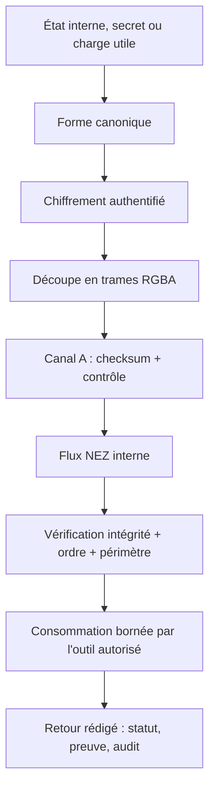
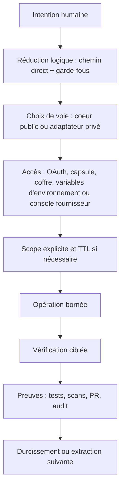
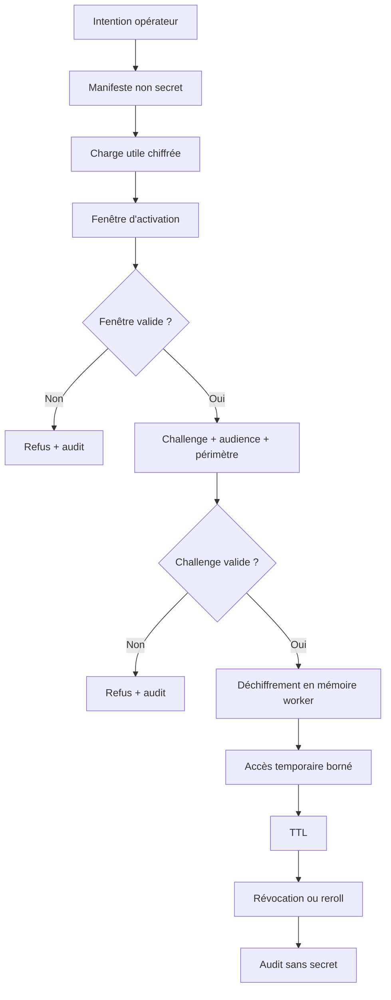

# Brief sécurité adaptative NOSSEN pour Sandro - 2026-05-23

Audience : revue externe par un ingénieur cybersécurité francophone.

Objectif : expliquer le modèle de sécurité adaptative NOSSEN sans exposer la
topologie opérateur spécialisée, les secrets, les jetons, les mots de passe,
les clés privées, les chemins locaux sensibles, les points d'accès privés ni les
runbooks privilégiés.

Ce document n'est pas une certification SOC 2 et ne prétend pas l'être. C'est
un dossier de préparation : ce qui existe déjà, ce qu'on peut montrer comme
preuves, et ce qui doit encore être durci avant un audit formel.

## Résumé court

NOSSEN sépare les briques publiques réutilisables des adaptateurs privés. Le
système repose sur quatre habitudes :

- ne jamais afficher une valeur secrète quand un test d'usage peut prouver le
  même résultat ;
- garder le code public générique et placer le contexte privé dans des
  adaptateurs bornés par périmètre ;
- faire passer les opérations sensibles par une intention explicite, un
  périmètre clair, une confirmation, des tests, une preuve et une trace d'audit ;
- traiter NEZ comme une couche d'infrastructure réseau interne, pas comme un
  simple nom d'en-tête HTTP ou une consigne de documentation.

Le modèle est adaptatif : le même raisonnement doit fonctionner pour un
paquet npm, un agent, un coffre, une capsule temporaire, un connecteur MCP, un
flux OAuth, une mémoire graphe, un paiement ou une intégration cloud.

## Ce que Sandro peut examiner

- La séparation entre modules publics et adaptateurs privés.
- Le modèle "preuve par usage" : on vérifie qu'un secret fonctionne sans le
  montrer.
- NEZ : réseau interne par flux de données chiffrés en RGBA, avec le canal `A`
  comme checksum et signal de contrôle.
- RubixGate : capsules temporaires, scopes, TTL, interrupteur d'urgence et audit.
- RubixCube vault : coffre chiffré, shards, inventaire rédigé.
- MCP : points d'accès publics/privés, liste d'autorisation d'outils, tableau de
  tâches, discussions sans secrets, opérations soumises à validation.
- OAuth : clients séparés par usage, scopes minimaux, jetons stockés hors
  interface, journaux rédigés.
- La piste de preuves : PR, vérifications CI, scans de secrets, tests, installations
  propres, audits npm.
- La cartographie de préparation SOC 2.

## Ce que ce brief ne partage pas

- Aucun jeton, mot de passe, clé API, clé privée, code de récupération, cookie,
  secret OAuth ou secret webhook.
- Aucune capture qui révèle un secret ou un code de récupération.
- Aucune topologie interne spécialisée.
- Aucun bearer MCP privé.
- Aucun identifiant de fournisseur : npm, GitHub, Cloudflare, Google, Neo4j,
  Docker, Stripe, PayPal ou autre service.
- Aucun chemin local opérateur exploitable.

## Lecture locale de NEZ

Le corpus local décrit déjà trois briques qui se recoupent :

- une couche NEZ de contrôle d'accès API, avec modes `off`, `dev` et `strict`,
  et protection par JWT ou en-tête dédié ;
- une famille Nezlephant/OC8 orientée stockage de blobs, charges utiles et
  configurations dans des supports RGBA ;
- un format d'archive RGBA/Brotli réversible et vérifiable, qui transforme une
  information structurée en octets puis en PNG RGBA sans perte, avec manifestes
  et empreintes d'intégrité.

La définition cible à retenir pour NOSSEN est donc plus large que la première
documentation historique : NEZ est une infrastructure réseau interne par flux
de données chiffrés en RGBA. Les anciennes règles de non-exposition restent
vraies, mais elles sont la politique de surface au-dessus de NEZ, pas NEZ à
elles seules.

## NEZ : réseau interne par flux RGBA chiffrés

NEZ peut être présenté comme une couche de transport interne pour agents,
outils et modules. Son rôle est de déplacer de l'état, des preuves, des
fragments de secrets ou des charges utiles d'orchestration sans jamais exposer la
valeur brute dans les interfaces humaines, les journaux ou les discussions agents.

Modèle de trame logique :

```txt
trame NEZ
  R : fragment chiffré ou canal de charge utile
  G : fragment chiffré ou canal de charge utile
  B : fragment chiffré ou canal de charge utile
  A : checksum, séquence, validité ou signal de contrôle
```

Le canal `A` ne doit pas être vendu comme une preuve cryptographique complète à
lui seul. Il sert au contrôle rapide d'intégrité, de séquence ou de cohérence
du flux. La garantie forte doit rester portée par du chiffrement authentifié,
des nonces corrects, des empreintes ou MAC cryptographiques, et des règles
anti-rejeu.

Pipeline conceptuel :



Règles NEZ :

- un flux peut transporter une capacité, mais l'interface ne doit jamais
  afficher la capacité brute ;
- la vérification doit retourner un statut, un périmètre, un identifiant non
  sensible ou une preuve d'usage, pas le secret ;
- le décodage doit être borné à un outil autorisé, un périmètre et une fenêtre
  d'exécution ;
- les trames doivent être vérifiables : checksum `A`, empreinte de charge utile,
  manifeste, anti-rejeu et audit ;
- une corruption, un ordre invalide ou un périmètre absent doit produire un refus
  explicite et traçable ;
- la compression éventuelle doit être pensée avant chiffrement, avec attention
  aux attaques par oracle de compression si des secrets et données contrôlées
  par l'utilisateur cohabitent.

Questions techniques à faire relire par Sandro :

- Le canal `A` doit-il contenir un checksum simple, un fragment de MAC, un
  compteur, ou une combinaison des trois ?
- Comment gérer les nonces pour éviter toute réutilisation de clé/nonce sur
  plusieurs flux ?
- Quelle stratégie anti-rejeu : compteur monotone, horodatage borné, fenêtre
  glissante, signature de trame ou manifeste global ?
- Les trames RGBA doivent-elles être sérialisées en PNG sans perte uniquement, ou
  aussi en flux binaire direct pour les transports temps réel ?
- Quels contrôles empêchent un agent de demander un décodage NEZ hors périmètre ?
- Quelle partie peut être démontrée publiquement sans révéler le schéma interne
  complet ?

## Modèle adaptatif



Chaque étape doit rester simple. La créativité est dans le produit et
l'orchestration ; l'exécution sensible doit rester répétable, vérifiable et
révocable.

## Sécurité MCP au-dessus de NEZ

Le MCP est traité comme une surface d'orchestration, pas comme un shell libre.
Dans le modèle NOSSEN, MCP est l'interface d'outils ; NEZ est la couche interne
qui transporte ou protège les flux sensibles ; RubixGate et RubixCube encadrent
respectivement l'autorisation temporaire et le stockage.

| Voie | Usage | Niveau de risque | Exemple de garde-fou |
| --- | --- | --- | --- |
| Public lecture seule | recherche, récupération, statut public, accueil technique | faible | aucun secret, outils lecture seule |
| Privé contrôlé | discussions, tâches, statut, routage, lectures bornées | moyen | authentification, scopes, sans secret, liste d'autorisation |
| Opérations soumises à validation | écritures en ajout uniquement, entrée bornée, publication, écriture graph contrôlée | élevé | confirmation, périmètre, audit, retour arrière |

Bloqué par défaut :

- shell libre ;
- lecture de fichiers hors liste d'autorisation ;
- lecture de secrets ;
- accès root ou `docker.sock` ;
- redémarrage de workers par agents externes ;
- écriture directe non bornée dans Neo4j ;
- mutation production, déploiement ou facturation sans validation explicite.

### Auth MCP

Le modèle accepte plusieurs mécanismes, chacun avec un rôle clair :

- point d'accès public sans secret pour documentation, recherche et statut ;
- jeton bearer ou OAuth pour la voie privée ;
- processus local pour les outils qui ne doivent pas être exposés au réseau ;
- capsule RubixGate pour un accès temporaire ;
- variables d'environnement, coffre local ou console fournisseur pour les
  secrets longs ;
- flux NEZ pour transporter les preuves et capacités internes sans les exposer
  dans l'interface MCP.

Le bearer ou jeton OAuth ne doit jamais être collé dans une discussion, un
ticket, une PR ou une capture. Les agents doivent prouver l'accès par un appel
borné, par exemple "tools/list OK, N outils visibles", pas par affichage du
jeton.

### Outils MCP

Les outils sont classés par politique :

- lecture publique : recherche, récupération, statut ;
- lecture privée contrôlée : présence, heartbeat, statut de tâche, schéma, statut graph,
  statut service, inventaire rédigé ;
- opérations soumises à validation : enqueue/lease/complete job, écriture en
  ajout uniquement, écriture graph contrôlée, publication d'artefact, entrée locale bornée ;
- bloqué par défaut : secrets, shell libre, déploiement production, paiement, suppression
  large, retour arrière non borné.

Chaque tâche MCP doit avoir :

```txt
id:
owner:
périmètre:
risque:
reproduction:
condition de fin:
retour_arrière:
```

## OAuth

Le principe OAuth est la séparation par usage.

### Client identité

Le client de connexion doit rester minimal :

- `openid` ;
- `email` ;
- `profile`.

Il sert à identifier l'utilisateur, ouvrir une session et afficher un profil de
base. Il ne doit pas demander d'accès Drive, YouTube, Gmail ou Workspace si ces
actions ne sont pas nécessaires à la connexion.

### Clients sensibles séparés

Les scopes sensibles doivent être portés par un client séparé et seulement pour
un module qui en a besoin. Exemple générique :

- un client média peut demander un scope de fichier choisi explicitement par
  l'utilisateur ;
- un client de téléversement peut publier un contenu seulement après action explicite ;
- le client identité ne doit pas hériter de ces scopes.

### Règles OAuth

- Scopes minimaux par client.
- Redirect URIs placées sur liste d'autorisation dans les consoles fournisseurs.
- Secrets OAuth stockés côté serveur, coffre local ou console fournisseur.
- Jetons jamais affichés dans l'interface.
- Logs qui rédigent jetons, jetons de rafraîchissement, secrets client et en-têtes
  d'autorisation.
- Comptes de test séparés si l'application reste en mode test fournisseur.
- Validation humaine avant toute publication ou téléversement externe.

## Capsules RubixGate

RubixGate est un modèle d'accès temporaire. Une capsule n'est pas un mot de
passe partagé ; c'est un conteneur d'intention, de périmètre et de temps.

Cycle générique :



Une capsule publique peut contenir :

- identifiant ;
- audience ;
- scope ;
- fenêtre d'activation ;
- TTL ;
- empreinte de la charge utile ;
- statut : planned, armed, active, expired, revoked.

Elle ne doit pas contenir le secret décodé. Le secret n'existe que dans le
chemin worker autorisé, pour une durée limitée, avec audit et interrupteur
d'urgence.

## Coffre RubixCube

RubixCube vault est le modèle de coffre.

Architecture générique :

- paquet chiffré avant stockage ;
- chiffrement authentifié ;
- dérivée de clé via passphrase opérateur ;
- shards ou conteneurs transportables ;
- manifeste avec empreintes et métadonnées non secrètes ;
- vérification de statut qui confirme l'intégrité sans déchiffrer ;
- consommation par chemins placés sur liste d'autorisation uniquement.

Point important : l'image, le shard ou le support RGBA n'est pas la sécurité
principale. La sécurité vient du chiffrement, du contrôle de la passphrase, de
la consommation bornée et de la règle de non-sortie brute.

## Packages publics et privés

Les packages publics sont sous `@nossen/*`.

Règles :

- rester génériques ;
- aucune topologie privée ;
- aucun chemin machine personnel ;
- aucun identifiant ou secret d'accès ;
- liens de support volontaires seulement ;
- API et CLI réutilisables.

Les packages privés sont sous `@funeste/*`.

Règles :

- adapter les modules publics au contexte opérateur ;
- lire les secrets à l'exécution depuis variables d'environnement, coffre ou
  console fournisseur ;
- ne jamais embarquer de secret dans le package ;
- tester par install propre et audit.

Preuves actuelles :

- `@nossen/logic-reduce@2.0.0` public ;
- `@funeste/logic-reduce-nossen@2.0.0` privé en accès restreint ;
- accès privé par équipe npm org ;
- installation fraîche et audit réussis sur la paire testée.

## Mémoire et graphe avec priorité aux métadonnées

La mémoire ne doit pas devenir un dépôt de contenu privé. Les index et graphes
doivent privilégier :

- labels de racines ;
- chemins relatifs ;
- type de fichier ;
- taille ;
- date de modification ;
- empreinte pour fichiers raisonnables ;
- statut de confidentialité ;
- liens sémantiques entre éléments déjà connus.

Les chemins ressemblant à des secrets sont ignorés. Les contenus larges, cloud
ou personnels commencent en mode métadonnées uniquement, avec plafond strict et
revue humaine.

## Gestion du changement

Chemin direct :

1. lire le preflight avant toute affirmation infra, auth, prod ou MCP ;
2. choisir le fichier ou paquet exact ;
3. patch minimal ;
4. tests ciblés ;
5. paquet d'essai ou installation propre si paquet npm ;
6. PR ;
7. scans et CI verts ;
8. fusion seulement après vérification.

La vitesse vient de la précision, pas du contournement des garde-fous.

## Cartographie de préparation SOC 2

SOC 2 couvre des critères de confiance comme sécurité, disponibilité, intégrité
de traitement, confidentialité et vie privée. Un vrai rapport nécessite un
auditeur indépendant. Ici, on cartographie le niveau de préparation.

| Domaine | Déjà présent | À durcir |
| --- | --- | --- |
| Sécurité | règle sans secret, scopes, packages privés, scans CI, coffre, capsules, NEZ | revue d'accès périodique, matrice propriétaires, preuves d'anti-rejeu |
| Disponibilité | inventaire services, packages publiés, notes de démarrage automatique | RTO/RPO, tests de restauration, preuve de disponibilité |
| Intégrité | tests, essais à blanc, installations fraîches, vérifications de PR, sommes de contrôle RGBA | politique formelle de release et rétention |
| Confidentialité | voies public/privé, priorité aux métadonnées, exclusion coffre | classification des données et validation humaine |
| Vie privée | pas de données personnelles par défaut dans docs, corpus borné | inventaire vie privée, procédure export/suppression |

## Pack de preuves à préparer

- PR avec vérifications vertes et commits de fusion.
- Sorties Gitleaks et secret scan.
- Sorties CodeQL et dependency audit.
- Vérifications npm public/privé.
- Installations propres avec audit.
- Statut du coffre qui montre l'intégrité sans valeur secrète.
- Essai à blanc d'index source montrant les entrées secrètes ignorées.
- Registre d'accès avec rôles, sans identifiants ni secrets.
- Procédure incident : fuite jeton, package compromis, appareil perdu, webhook
  fournisseur compromis.
- Exemple de capsule en essai à blanc : créée, refusée hors fenêtre, auditée sans
  secret.
- Démonstrateur NEZ : trame RGBA chiffrée, `A` checksum, corruption détectée,
  refus hors périmètre, aucune valeur brute en sortie.

## Questions pour Sandro

- Le modèle "preuve par usage sans affichage de secret" est-il suffisant pour
  travailler avec des agents externes ?
- Quels contrôles doivent être obligatoires avant d'ajouter un autre humain ?
- Les capsules doivent-elles rester locales d'abord ou passer directement par
  un gestionnaire de secrets géré ?
- Quelles preuves sont les plus utiles pour une première revue de préparation
  SOC 2 ?
- Quelles parties peuvent être montrées sous NDA, et lesquelles doivent rester
  opérateur-only ?
- Comment modéliser les capacités agents sans révéler l'implémentation
  spécialisée ?
- Quels contrôles OAuth manquent pour rendre le système défendable devant un
  relecteur externe ?
- La couche NEZ doit-elle être spécifiée comme protocole, bibliothèque, format
  d'archive, middleware réseau, ou les quatre avec des frontières claires ?

## Prochaine vague de durcissement

1. Spécification NEZ v0 : format de trame, rôle exact de `A`, nonces,
   anti-rejeu, erreurs, manifestes et politique de décodage.
2. Démonstrateur NEZ local sans secret : encode, transporte, altère une trame,
   détecte la corruption et refuse la sortie brute.
3. Inventaire formel des actifs, propriétaires et classification des données.
4. Checklist trimestrielle de revue d'accès npm, GitHub, fournisseurs cloud,
   consoles de paiement et MCP.
5. Cycle de vie RubixGate en commandes d'essai à blanc testées.
6. Procédure de fuite de secret avec ordre de rotation et preuves à capturer.
7. Exercices de restauration graph/config/métadonnées packages.
8. Diagramme d'architecture anonymisé pour revue externe.
9. Annexe spécialisée gardée privée, séparée de ce brief adaptatif.

## Références externes

- npm private packages: https://docs.npmjs.com/about-private-packages/
- npm organizations: https://docs.npmjs.com/organizations/
- npm private package publishing: https://docs.npmjs.com/creating-and-publishing-private-packages/
- AICPA SOC overview: https://www.aicpa-cima.com/soc
- AICPA SOC 2 guide: https://www.aicpa-cima.com/cpe-learning/publication/soc-2-reporting-on-an-examination-of-controls-at-a-service-organization-relevant-to-security-availability-processing-integrity-confidentiality-or-privacy
