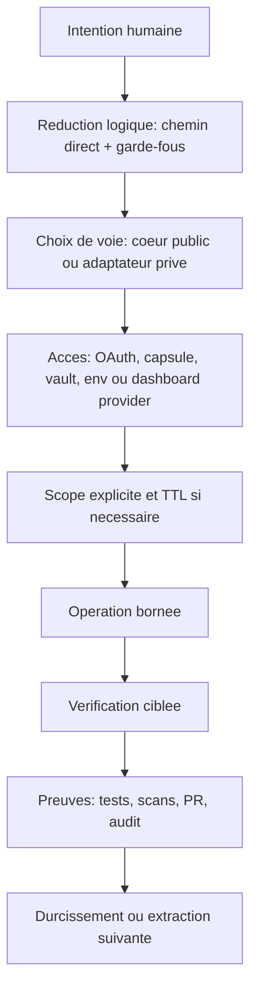
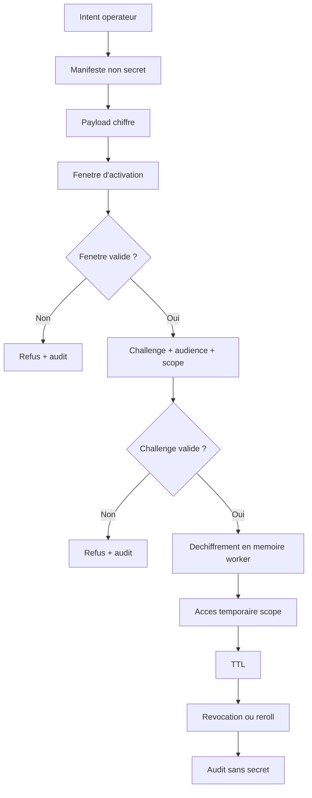

# Brief securite adaptative NOSSEN pour Sandro - 2026-05-23

Audience : revue externe par un ingenieur cybersecurite francophone.

Objectif : expliquer le modele de securite adaptative NOSSEN sans exposer la
topologie operateur specialisee, les secrets, les tokens, les mots de passe,
les cles privees, les chemins locaux sensibles, les endpoints prives ou les
runbooks privilegies.

Ce document n'est pas une certification SOC 2 et ne pretend pas l'etre. C'est
un dossier de preparation : ce qui existe deja, ce qu'on peut montrer comme
preuves, et ce qui doit etre durci avant un audit formel.

## Resume court

NOSSEN separe les briques publiques reutilisables des adaptateurs prives. Le
systeme repose sur trois habitudes :

- ne jamais afficher une valeur secrete quand un test d'usage peut prouver le
  meme resultat ;
- garder le code public generique et placer le contexte prive dans des
  adaptateurs scopes ;
- borner chaque operation sensible par un scope, une confirmation, des tests,
  une preuve et une trace d'audit.

Le modele est adaptatif : le meme raisonnement doit fonctionner pour un
package, un agent, un coffre, une capsule temporaire, un connecteur MCP, un
flux OAuth, une memoire graphe, un paiement ou une integration cloud.

## Ce que Sandro peut examiner

- La separation entre modules publics et adaptateurs prives.
- Le modele "preuve par usage" : on verifie qu'un secret fonctionne sans le
  montrer.
- Les regles NEZ de non-exposition des secrets.
- Le modele RubixGate : capsules temporaires, scopes, TTL, kill-switch et audit.
- Le modele RubixCube vault : stockage chiffre, shards, inventaire redige.
- Le modele MCP : endpoints publics/prives, allowlist d'outils, job board,
  discussions sans secrets, operations gatees.
- Le modele OAuth : clients separes par usage, scopes minimaux, tokens stockes
  hors interface, logs rediges.
- La piste de preuves : PR, checks CI, scans secrets, tests, installs propres,
  audits npm.
- La cartographie SOC 2 readiness.

## Ce que ce brief ne partage pas

- Aucun token, mot de passe, cle API, cle privee, code de recuperation, cookie,
  secret OAuth ou secret webhook.
- Aucune capture qui revele un secret ou un code de recuperation.
- Aucune topologie interne specialisee A11.
- Aucun bearer MCP prive.
- Aucun credential de provider : npm, GitHub, Cloudflare, Google, Neo4j,
  Docker, Stripe, PayPal ou autre service.
- Aucun chemin local operateur exploitable.

## Modele adaptatif



Chaque etape doit rester simple. La creativite est dans le produit et
l'orchestration ; l'execution sensible doit rester repetable, verifiable et
revocable.

## Principe NEZ : ne pas exposer les secrets

NEZ est la discipline de non-exposition. Un agent, un outil, une doc ou une
interface ne doit pas afficher de secret brut. Quand un token ou un credential
doit etre verifie, on le consomme dans un chemin autorise et on retourne
seulement :

- succes ou echec ;
- nom de compte ou de scope si ce n'est pas sensible ;
- nombre d'outils, de packages ou d'endpoints accessibles ;
- inventaire redige ;
- timestamps et metadonnees non secretes.

Cette regle s'applique aux chats, PR, logs, captures, messages MCP, noeuds de
graphe, jobs agents et docs.

## Securite MCP

Le MCP est traite comme une surface d'orchestration, pas comme un shell libre.
Le modele generique separe trois voies :

| Voie | Usage | Niveau de risque | Exemple de garde-fou |
| --- | --- | --- | --- |
| Public read-only | recherche, fetch, statut public, onboarding | faible | aucun secret, outils lecture seule |
| Prive safe | discussions, jobs, statut, routage, lectures bornees | moyen | auth, scopes, no-secret, allowlist |
| Operations gated | ecritures append-only, input borne, publication, graph safe write | eleve | confirmation, scope, audit, rollback |

Bloque par defaut :

- shell libre ;
- lecture de fichiers hors allowlist ;
- lecture de secrets ;
- acces root ou `docker.sock` ;
- redemarrage de workers par agents externes ;
- ecriture directe non bornee dans Neo4j ;
- mutation prod/deploy/billing sans validation explicite.

### Auth MCP

Le modele accepte plusieurs mecanismes, chacun avec un role clair :

- endpoint public sans secret pour documentation, recherche et statut ;
- bearer ou OAuth pour la voie privee ;
- process local pour les outils qui ne doivent pas etre exposes au reseau ;
- capsule RubixGate pour un acces temporaire ;
- variables d'environnement, coffre local ou dashboard provider pour les
  secrets longs.

Le bearer ou token OAuth ne doit jamais etre colle dans une discussion, un
ticket, une PR ou une capture. Les agents doivent prouver l'acces par un appel
borne, par exemple "tools/list OK, N outils visibles", pas par affichage du
token.

### Outils MCP

Les outils sont classes par politique :

- lecture publique : recherche, fetch, statut ;
- lecture privee safe : presence, heartbeat, job status, schema, statut graph,
  statut service, inventaire redige ;
- operations gatees : enqueue/lease/complete job, ecriture append-only, graph
  safe write, publication d'artefact, input local borne ;
- bloque par defaut : secrets, shell libre, prod deploy, paiement, suppression
  large, rollback non scope.

Chaque tache MCP doit avoir :

```txt
id:
owner:
scope:
risque:
reproduction:
condition de fin:
rollback:
```

## OAuth

Le principe OAuth est la separation par usage.

### Client identite

Le client de connexion doit rester minimal :

- `openid` ;
- `email` ;
- `profile`.

Il sert a identifier l'utilisateur, ouvrir une session et afficher un profil de
base. Il ne doit pas demander d'acces Drive, YouTube, Gmail ou Workspace si ces
actions ne sont pas necessaires au login.

### Clients sensibles separes

Les scopes sensibles doivent etre portes par un client separe et seulement pour
un module qui en a besoin. Exemple generique :

- un client media peut demander un scope de fichier choisi explicitement par
  l'utilisateur ;
- un client upload peut publier un contenu seulement apres action explicite ;
- le client identite ne doit pas heriter de ces scopes.

### Regles OAuth

- Scopes minimaux par client.
- Redirect URIs allowlistes dans les dashboards providers.
- Secrets OAuth stockes cote serveur, coffre local ou dashboard provider.
- Tokens jamais affiches dans l'interface.
- Logs qui redigent jetons, refresh tokens, secrets client et headers
  d'autorisation.
- Comptes de test separes si l'application reste en mode test provider.
- Validation humaine avant toute publication ou upload externe.

## Capsules RubixGate

RubixGate est un modele d'acces temporaire. Une capsule n'est pas un mot de
passe partage ; c'est un conteneur d'intention, de scope et de temps.

Cycle generique :



Une capsule publique peut contenir :

- identifiant ;
- audience ;
- scope ;
- fenetre d'activation ;
- TTL ;
- hash du payload ;
- statut : planned, armed, active, expired, revoked.

Elle ne doit pas contenir le secret decode. Le secret n'existe que dans le
chemin worker autorise, pour une duree limitee, avec audit et kill-switch.

## RubixCube vault

RubixCube vault est le modele de coffre.

Architecture generique :

- bundle chiffre avant stockage ;
- chiffrement authentifie ;
- derivee de cle via passphrase operateur ;
- shards ou conteneurs transportables ;
- manifeste avec hashes et metadonnees non secretes ;
- status check qui verifie l'integrite sans dechiffrer ;
- consommation par chemins whitelistes uniquement.

Point important : l'image ou le shard n'est pas la securite principale.
La securite vient du chiffrement, du controle de la passphrase, de la
consommation bornee et de la regle no-output.

## Packages publics et prives

Les packages publics sont sous `@nossen/*`.

Regles :

- rester generiques ;
- aucune topologie privee ;
- aucun chemin machine personnel ;
- aucun credential ;
- liens de support volontaires seulement ;
- API et CLI reutilisables.

Les packages prives sont sous `@funeste/*`.

Regles :

- adapter les modules publics au contexte operateur ;
- lire les secrets au runtime depuis env, coffre ou provider dashboard ;
- ne jamais embarquer de secret dans le package ;
- tester par install propre et audit.

Preuves actuelles :

- `@nossen/logic-reduce@2.0.0` public ;
- `@funeste/logic-reduce-nossen@2.0.0` prive restricted ;
- acces prive par equipe npm org ;
- installation fraiche et audit reussis sur la paire testee.

## Memoire et graphe metadata-first

La memoire ne doit pas devenir un depot de contenu prive. Les index et graphes
doivent privilegier :

- labels de racines ;
- chemins relatifs ;
- type de fichier ;
- taille ;
- date de modification ;
- hash pour fichiers raisonnables ;
- statut de confidentialite ;
- liens semantiques entre elements deja connus.

Les chemins ressemblant a des secrets sont ignores. Les contenus larges, clouds
ou personnels commencent en metadata-only, avec plafond strict et revue humaine.

## Gestion du changement

Chemin direct :

1. lire le preflight avant toute affirmation infra/auth/prod/MCP ;
2. choisir le fichier ou package exact ;
3. patch minimal ;
4. tests cibles ;
5. dry pack ou install propre si package ;
6. PR ;
7. scans et CI verts ;
8. merge seulement apres verification.

La vitesse vient de la precision, pas du contournement des garde-fous.

## Cartographie SOC 2 readiness

SOC 2 couvre des criteres de confiance comme securite, disponibilite, integrite
de traitement, confidentialite et vie privee. Un vrai rapport necessite un
auditeur independant. Ici, on cartographie la readiness.

| Domaine | Deja present | A durcir |
| --- | --- | --- |
| Securite | no-secret, scopes, packages prives, scans CI, vault, capsules | revue d'acces periodique, matrice proprietaires |
| Disponibilite | inventaire services, packages publies, notes autostart | RTO/RPO, tests de restore, evidence uptime |
| Integrite | tests, dry-runs, fresh installs, PR checks | politique formelle de release et retention |
| Confidentialite | lanes public/prive, metadata-first, exclusion vault | classification data et validation humaine |
| Vie privee | pas de PII par defaut dans docs, corpus borne | inventaire privacy, procedure export/suppression |

## Pack de preuves a preparer

- PRs avec checks verts et commits de merge.
- Sorties Gitleaks et secret scan.
- Sorties CodeQL et dependency audit.
- Verifications npm public/prive.
- Fresh installs avec audit.
- Statut vault qui montre l'integrite sans valeur secrete.
- Dry-run source index montrant les entrees secretes ignorees.
- Roster d'acces avec roles, sans credentials.
- Runbook incident : fuite token, package compromis, appareil perdu, webhook
  provider compromis.
- Exemple de capsule dry-run : creee, refusee hors fenetre, auditee sans secret.

## Questions pour Sandro

- Le modele "preuve par usage sans affichage de secret" est-il suffisant pour
  travailler avec des agents externes ?
- Quels controles doivent etre obligatoires avant d'ajouter un autre humain ?
- Les capsules doivent-elles rester locales d'abord ou passer directement par
  un secret manager gere ?
- Quelles preuves sont les plus utiles pour une premiere revue SOC 2 readiness ?
- Quelles parties peuvent etre montrees sous NDA, et lesquelles doivent rester
  operateur-only ?
- Comment modeliser les capacites agents sans reveler l'implementation
  specialisee ?
- Quels controles OAuth manquent pour rendre le systeme defendable devant un
  reviewer externe ?

## Prochaine vague de durcissement

1. Inventaire formel des actifs, proprietaires et classification data.
2. Checklist trimestrielle de revue d'acces npm, GitHub, cloud providers,
   payment dashboards et MCP.
3. Lifecycle RubixGate en commandes dry-run testees.
4. Runbook fuite secret avec ordre de rotation et preuves a capturer.
5. Exercices de restore graph/config/package metadata.
6. Diagramme d'architecture sanitise pour revue externe.
7. Annexe specialisee gardee privee, separee de ce brief adaptatif.

## References externes

- npm private packages: https://docs.npmjs.com/about-private-packages/
- npm organizations: https://docs.npmjs.com/organizations/
- npm private package publishing: https://docs.npmjs.com/creating-and-publishing-private-packages/
- AICPA SOC overview: https://www.aicpa-cima.com/soc
- AICPA SOC 2 guide: https://www.aicpa-cima.com/cpe-learning/publication/soc-2-reporting-on-an-examination-of-controls-at-a-service-organization-relevant-to-security-availability-processing-integrity-confidentiality-or-privacy
