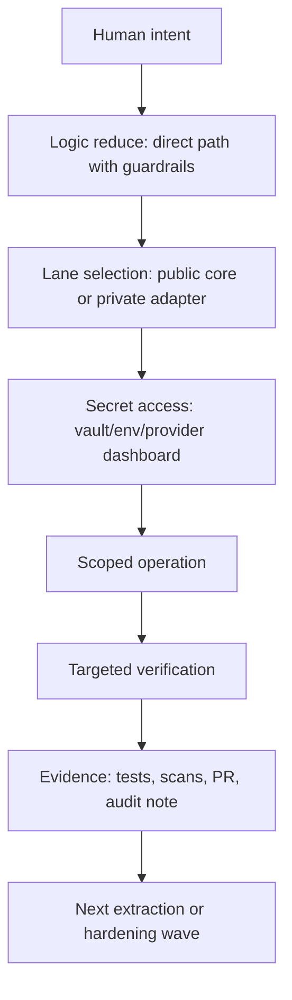

# NOSSEN adaptive security brief for Sandro - 2026-05-23

Audience: external cybersecurity review.

Purpose: explain the reusable adaptive security model behind NOSSEN without
exposing operator-specific A11 topology, raw secrets, tokens, credentials,
machine paths, private endpoints, or privileged runbooks.

This is not a SOC 2 report and not a certification claim. It is a readiness
brief: what exists, what evidence we can show, and what needs hardening before a
formal audit.

## Short version

NOSSEN separates reusable public modules from private operator adapters. The
system is built around three habits:

- never reveal secret material when a status check can prove the same thing;
- keep public code generic and private context in scoped adapters;
- make every sensitive operation bounded by scope, confirmation, tests and
audit evidence.

The security posture is adaptive rather than single-purpose. A package, agent,
vault, graph index, payment integration, or cloud connector should follow the
same rules: scoped access, metadata-first indexing, no raw secret output,
targeted verification, and a clean rollback path.

## What Sandro can review

- The public/private package lane design.
- The secret-free source indexing model.
- The RubixGate and RubixCube vault patterns at architecture level.
- The NEZ no-exposure discipline.
- The agent orchestration safety model at abstract level.
- The evidence trail: PRs, checks, tests, fresh installs, audits and scan
  outputs.
- The SOC 2 readiness gap list.

## What we do not share in this brief

- Raw tokens, API keys, passwords, private keys, recovery codes or webhook
  signing secrets.
- Screenshots that reveal tokens or account recovery material.
- Exact operator-only A11 topology or privileged local paths.
- Full MCP bearer values or private endpoint credentials.
- Provider dashboard secrets for npm, Stripe, PayPal, Cloudflare, Google,
  GitHub, Neo4j, Docker, or any other service.

## Adaptive model

The model is intentionally boring at each step. Creativity belongs in the
product and orchestration; sensitive execution stays repeatable.

## Core controls

### 1. NEZ no-exposure discipline

NEZ is the rule that agents, docs and logs must not expose secret material.
Whenever possible, the system proves a secret works by using it against a
target service and returning only:

- success or failure;
- account or scope name when safe;
- package, tool or endpoint counts;
- redacted inventory;
- timestamps and non-secret metadata.

The rule applies to chat output, PR bodies, screenshots, Neo4j nodes, agent bus
messages, logs and docs.

### 2. RubixGate capsules

RubixGate is a scoped access pattern for temporary capability grants. The
generic concept:

- operator declares intent, scope, audience and time window;
- a capsule manifest stores non-secret metadata;
- encrypted payloads stay unreadable outside the worker path;
- activation is bounded by TTL, challenge and kill switch;
- audit events never include secret values.

This is useful for external agents or future reviewers because they can be
given narrow access without learning the whole private system.

### 3. RubixCube vault

RubixCube vault is a local secret bundle pattern. At architecture level:

- secret bundles are encrypted before storage;
- status checks can verify shard integrity without decrypting values;
- consumption paths should be whitelisted and purpose-specific;
- recovered plaintext, if ever needed, is temporary and operator-controlled;
- vault material is excluded from git, source indexing and public docs.

The important design point: the image/shard idea is not treated as security by
itself. Security comes from authenticated encryption, passphrase handling,
controlled consumption and no-output rules.

### 4. Public/private package lanes

Public packages live under `@nossen/*` and must remain generic:

- no private topology;
- no personal machine paths;
- no credentials;
- voluntary support links only;
- reusable APIs and CLIs.

Private packages live under `@funeste/*` and bind public modules to operator
profiles. They may know provider names or product-specific defaults, but they
still cannot contain raw credentials.

Current package evidence:

- public `@nossen/logic-reduce@2.0.0`;
- private `@funeste/logic-reduce-nossen@2.0.0`;
- private access through the npm org team model;
- fresh install and audit checks completed with zero reported vulnerabilities
  for the tested package pair.

### 5. Metadata-first memory

The source index, graph memory and semantic maps should prefer metadata before
content:

- root label;
- relative path;
- file type;
- size and modified time;
- hash for reasonable files;
- confidentiality status;
- links between known hashes and semantic clusters.

Secret-looking paths are skipped. Content is not copied into graph memory just
because it exists. Wide roots, cloud drives and personal corpora start disabled
or bounded until reviewed.

### 6. Change control

The direct path is:

1. read preflight for infra/auth/prod-sensitive claims;
2. choose the exact file or package;
3. patch minimal scope;
4. run targeted tests;
5. run package dry pack or install check when relevant;
6. push through PR;
7. wait for security and CI checks before merge.

This keeps fast execution without becoming uncontrolled execution.

## SOC 2 readiness map

SOC 2 uses Trust Services Criteria around security, availability, processing
integrity, confidentiality and privacy. A formal report requires independent
audit work; this brief only maps readiness.

| Area | What exists | What is still needed |
| --- | --- | --- |
| Security | no-secret rules, scoped packages, CI scans, vault patterns, MFA-capable providers | formal access review cadence, asset owner matrix |
| Availability | package registries, cloud/service inventory, reboot/autostart notes | defined RTO/RPO, restore drills, uptime evidence |
| Processing integrity | tests, pack dry-runs, fresh installs, PR checks | formal release approval policy and change log retention |
| Confidentiality | public/private lanes, metadata-first indexing, vault exclusion | data classification policy and reviewer signoff |
| Privacy | no PII-by-default docs, bounded corpus indexing | privacy inventory and deletion/export procedures |

## Evidence pack to prepare

- PR list with green checks and merge commits.
- Gitleaks and secret scan outputs.
- CodeQL and dependency audit outputs.
- npm public/private package verification.
- Fresh install logs with audit summaries.
- Vault status output that shows integrity without secret values.
- Source index dry-run showing skipped secret-like entries.
- Access roster with roles, not credentials.
- Incident playbook for leaked token, compromised package, lost device and
  provider webhook compromise.

## Questions for Sandro

- Is the no-secret proof-by-use pattern acceptable for external agent work?
- Which controls should become mandatory before onboarding another human?
- Should RubixGate capsules be implemented as local-only first, or backed by a
  managed secret manager from day one?
- What evidence is strongest for a first SOC 2 readiness review?
- Which private details can be shown under NDA, and which should stay
  operator-only even during review?
- What is the cleanest way to model agent capabilities without revealing the
  specialized A11 implementation?

## Recommended next hardening wave

1. Create a formal asset inventory with owners and data classification.
2. Add a quarterly access review checklist for npm, GitHub, cloud providers and
   payment dashboards.
3. Convert RubixGate capsule lifecycle into tested dry-run commands.
4. Add a secret-incident runbook with rotation order and evidence capture.
5. Add restore drills for graph/config/package metadata.
6. Prepare a sanitized architecture diagram for external review.
7. Keep the A11-specific implementation as a private appendix, not in this
   adaptive brief.

## External references

- npm private packages: https://docs.npmjs.com/about-private-packages/
- npm organizations: https://docs.npmjs.com/organizations/
- npm private package publishing: https://docs.npmjs.com/creating-and-publishing-private-packages/
- AICPA SOC overview: https://www.aicpa-cima.com/soc
- AICPA SOC 2 guide: https://www.aicpa-cima.com/cpe-learning/publication/soc-2-reporting-on-an-examination-of-controls-at-a-service-organization-relevant-to-security-availability-processing-integrity-confidentiality-or-privacy
